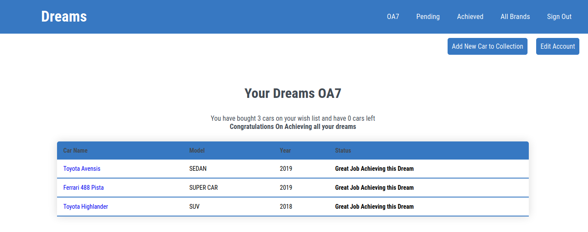
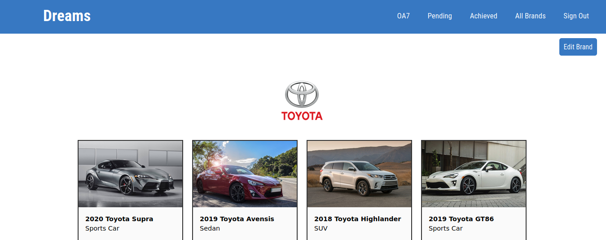
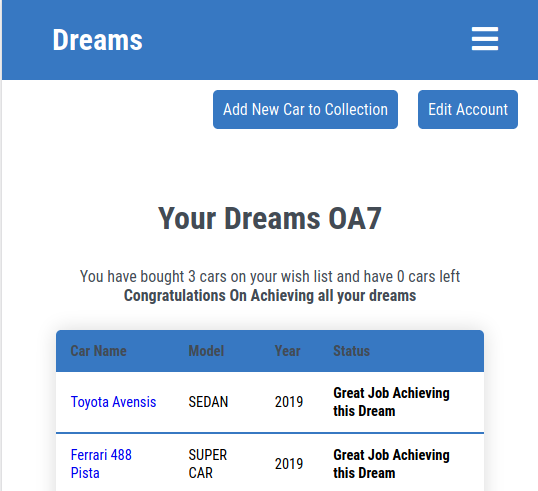
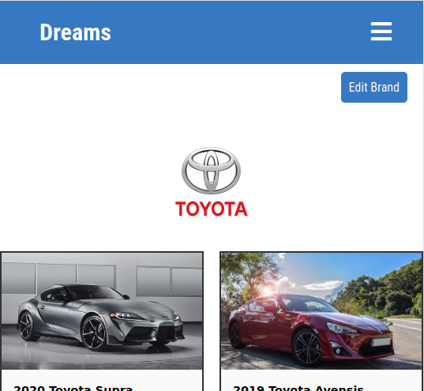

# Ruby on Rails Capstone Project
- In this project I built an MVP model of a Web Application where a user can create categories like **Technology**, **Automobile** etc and under those categories create projects or as the App name implies "dreams" which the user hopes to achieve in the future. For every dream the user achieves, he/she can scratch that off the pending list to the achieved list.
 
For now, the MVP model is just for cars. A user can create a list of cars he will like to own, with the Car's details like name, model, year it was made and brand. The user can also add **Brands** to the app. Each time the user succeeds in buying one of the cars he can update his list and remove the car from pending to achieved, and if he does buy all the cars on his list he gets a message congratulating him on his "Grind" for achieving his dreams.

## Screenshots of App for various screen sizes
 

  &nbsp; 

 

 &nbsp; 
 

 

## Built With

* Ruby on Rails
* HTML
* CSSS

## Getting Started

To get a local copy up and running follow these simple example steps.

- Open a terminal or command prompt interface on your machine
- Clone the project unto your local machine: `git clone https://github.com/OA7/Future-App.git`
- From your terminal enter the project directory using `cd Future-App` 

## Instructions

- Run `bundle install`
- Run `rails db:create && rails db:migrate`
- Run ` rails server ` or ` rails s ` on your terminal to start the integrated ruby server.
- Open your web browser and go to ` localhost:3000 `, to see that the rails sever is up and running.
- Enjoy the app.

## Live Demo Link

[Live Link](https://limitless-bastion-93158.herokuapp.com)

## Video Link

[Video Explanation Link]()

## Author

👤 **Osong Agberndifor**

- Github: [Osong Agberndifor](https://github.com/OA7)
- Twitter: [Osong Agberndifor](https://twitter.com/Osong17)
- Linkedin: [Osong Agberndifor](https://linkedin.com/osong-agberndifor)

## 🤝 Contributing

Contributions, issues and feature requests are welcome!

Feel free to check the [Issues page](https://github.com/OA7/Future-App/issues).

## Show your support

Give a ⭐️ if you like this project!

## Acknowledgements
  * [Microverse](https://www.microverse.org/)
  * The original designer of the UI for this application is [Gregoire Vella](https://www.behance.net/gregoirevella)

## License
 Distributed under the [Creative Commons License](https://creativecommons.org/licenses/by-nc/4.0/)
